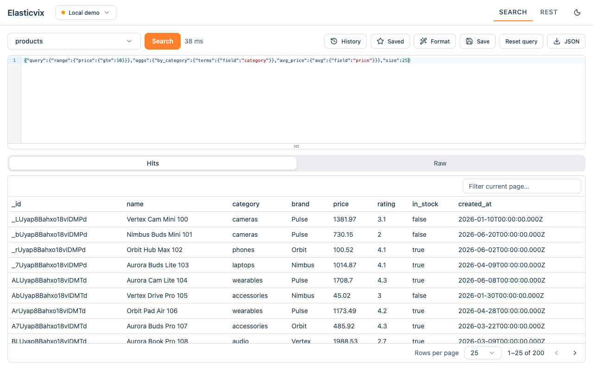

# Elasticvix

**An Elasticsearch client that runs entirely in your browser.** Connect to any cluster and start querying in seconds — no server, no desktop app, nothing sent to us.

Elasticvix is a Chrome extension (Manifest V3) built with [WXT](https://wxt.dev), React, and TypeScript. Query console with field-aware autocomplete, a point-and-click search UI, saved queries, and multi-cluster support — all local.

- 🌐 **Homepage:** <https://totanvix.github.io/elasticvix/>
- 📦 **Source:** <https://github.com/totanvix/elasticvix>
- ⚖️ **License:** [MIT](./LICENSE)



## Features

**Query console**
- Query DSL autocomplete that knows your data — suggestions include real field names read from your index mappings, not just static keywords
- Context-aware suggestions for API endpoints and query DSL
- JSON linting, formatting, and `Cmd`/`Ctrl` + `Enter` to run

**Search UI**
- Pick indices and search without hand-writing full requests
- Results in a hits table with a document detail view
- Run aggregations and inspect the raw response
- Download results as JSON

**Saved queries & history**
- Save queries with names and tags, find them again with search
- Automatic query history

**Multi-cluster**
- Store multiple connections and switch instantly
- Cluster health at a glance
- Auth: none, basic auth, API key, or bearer token

**Works with** Elasticsearch 6.x, 7.x, 8.x (tested) and 9.x (best effort).

## Install

### From the Chrome Web Store

See the [homepage](https://totanvix.github.io/elasticvix/) for the store link.

### From source (load unpacked)

```bash
pnpm install
pnpm build          # outputs to .output/chrome-mv3
```

Then in Chrome: open `chrome://extensions`, enable **Developer mode**, click **Load unpacked**, and select the `.output/chrome-mv3` directory.

## Usage

1. Click the Elasticvix toolbar icon — it opens the console in a full-page tab.
2. Add a connection: your cluster URL and, if needed, auth credentials.
3. Use the **Search** view to pick an index and query visually, or switch to the **REST** console to write Query DSL by hand.
4. Save queries you reuse; history is kept automatically.

Your connections, credentials, saved queries, and history are stored **locally in your browser**. Requests go only to the clusters you configure — there is no backend.

## Development

**Prerequisites:** Node.js and [pnpm](https://pnpm.io) (`packageManager: pnpm@10.12.4`).

```bash
pnpm install        # installs deps and runs `wxt prepare`
pnpm dev            # start the WXT dev server with hot reload
pnpm build          # production build → .output/chrome-mv3
pnpm zip            # package a distributable .zip
pnpm compile        # type-check with `tsc --noEmit`
pnpm test           # run the test suite (Vitest)
pnpm test:watch     # run tests in watch mode
```

### Local Elasticsearch for testing

`scripts/store/seed-es.mjs` seeds a local cluster with sample indices (products, users, logs). `ES_URL` is required:

```bash
ES_URL=http://localhost:9201 node scripts/store/seed-es.mjs
```

## Architecture

- **`entrypoints/`** — WXT entrypoints: the `background` service worker and the `console` full-page app.
- **`src/console/`** — the React UI, organized by feature: `connections/`, `editor/` (REST console), `search/` (search UI), `library/` (saved queries & history), plus shared `ui/` primitives.
- **`src/lib/`** — framework-agnostic logic: `es/` (Elasticsearch auth, mapping, version), `autocomplete/` (the Query DSL suggestion engine), `rpc/`, and `storage/`.

Elasticsearch requests are proxied through the background service worker via a small typed RPC layer (`esRequest`, `detectVersion`, `fetchMapping`). This keeps host access confined to the worker and lets the extension reach clusters on any URL — localhost, a private IP, or a cloud host. The extension has **no content scripts** and never reads or changes the pages you visit.

## Testing

Unit tests live next to the code they cover (`*.test.ts`) and run on [Vitest](https://vitest.dev) with jsdom and `fake-indexeddb`. Run the full suite with `pnpm test`.

## Privacy

All data stays on your machine. Connections, credentials, saved queries, and history are stored locally in your browser and sent only to the Elasticsearch clusters you configure. No analytics, no tracking, nothing ever sent to us. See the [privacy policy](docs/store/privacy-policy.md).

## Contributing

Issues and pull requests are welcome. Please run `pnpm compile` and `pnpm test` before opening a PR.

## License

[MIT](./LICENSE) © Tô Tấn Vĩ (totanvix)
